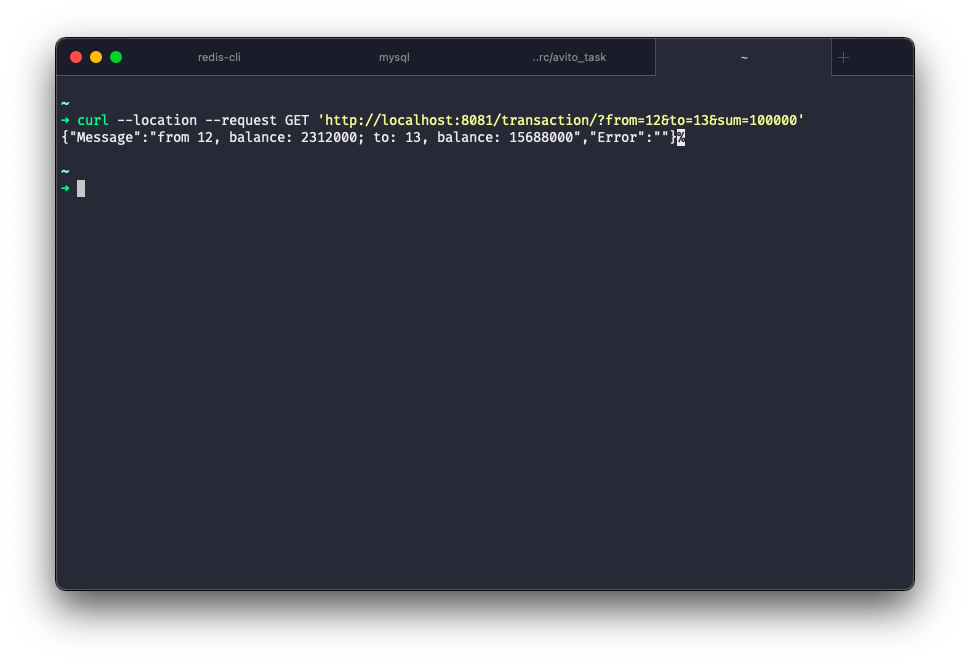
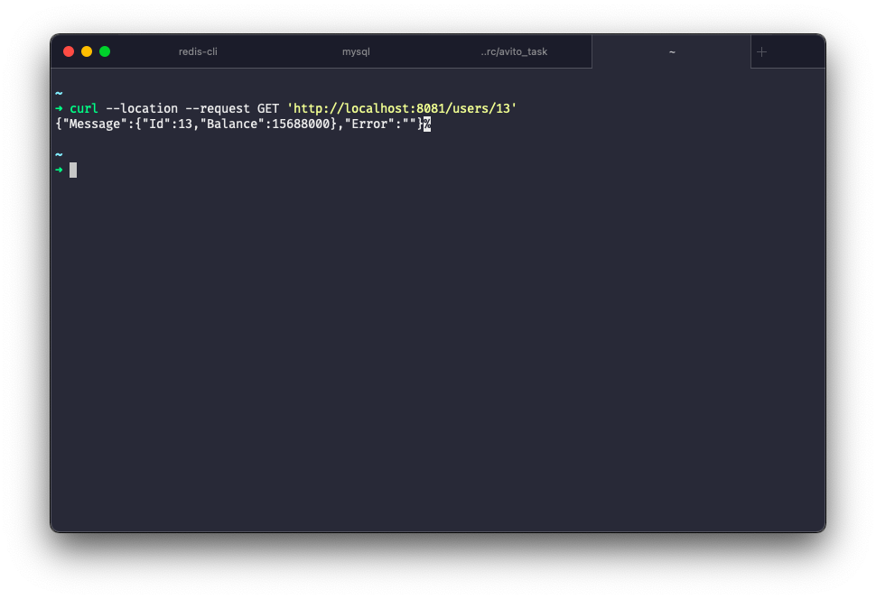

# Тестовое задание на позицию стажера-бекендера

## Микросервис для работы с балансом пользователей.

**Проблема:**

В нашей компании есть много различных микросервисов. Многие из них так или иначе хотят взаимодействовать с балансом пользователя. На архитектурном комитете приняли решение централизовать работу с балансом пользователя в отдельный сервис. 

**Задача:**

Необходимо реализовать микросервис для работы с балансом пользователей (зачисление средств, списание средств, перевод средств от пользователя к пользователю, а также метод получения баланса пользователя). Сервис должен предоставлять HTTP API и принимать/отдавать запросы/ответы в формате JSON. 

**Сценарии использования:**

Далее описаны несколько упрощенных кейсов приближенных к реальности.
1. Сервис биллинга с помощью внешних мерчантов (аля через visa/mastercard) обработал зачисление денег на наш счет. Теперь биллингу нужно добавить эти деньги на баланс пользователя. 
2. Пользователь хочет купить у нас какую-то услугу. Для этого у нас есть специальный сервис управления услугами, который перед применением услуги проверяет баланс и потом списывает необходимую сумму. 
3. В ближайшем будущем планируется дать пользователям возможность перечислять деньги друг-другу внутри нашей платформы. Мы решили заранее предусмотреть такую возможность и заложить ее в архитектуру нашего сервиса. 

**О проекте:**
1. Реляционная СУБД: MySQL
2. В проект подключены кеши(Redis)
3. Разработка интерфейса в браузере не предусмотрена, взаимодействие с АПИ предполагается посредством запросов из кода другого сервиса. Пара curl-запросов: 

**Основное задание (минимум):**

* Метод начисления средств на баланс. Принимает id пользователя и сколько средств зачислить.

* Метод списания средств с баланса. Принимает id пользователя и сколько средств списать. 

* Метод перевода средств от пользователя к пользователю. Принимает id пользователя с которого нужно списать средства, id пользователя которому должны зачислить средства, а также сумму.

* Метод получения текущего баланса пользователя. Принимает id пользователя. Баланс всегда в рублях.

**Детали по решению:**

1. Методы начисления и списания объеденены в один, списание производится в том случае, если вызывается отрицательное значение.
2. Механизм миграции не предусмотрен. В корне оставлен конечный SQL файл с созданием всех необходимых таблиц в БД, а также `.rdb` файл.
7. Баланс использует тип `int64`, где разряды единицы и десятки отвечают за количество малого денежного знака (копейки, центы, etc). Пример: сумма номиналом 10123 рублей 99 копеек будет записана как `1012399`.

**Не сделано:**

* Эффективные менеджеры захотели добавить в наши приложения товары и услуги в различных от рубля валютах. Необходима возможность вывода баланса пользователя в отличной от рубля валюте.
Задача: добавить к методу получения баланса доп. параметр. Пример: ?currency=USD. 
Если этот параметр присутствует, то мы должны конвертировать баланс пользователя с рубля на указанную валюту. Данные по текущему курсу валют можно взять отсюда https://exchangeratesapi.io/ или из любого другого открытого источника. 
Примечание: напоминаем, что базовая валюта которая хранится на балансе у нас всегда рубль. В рамках этой задачи конвертация всегда происходит с базовой валюты.

* Пользователи жалуются, что не понимают за что были списаны (или зачислены) средства. 
Задача: необходимо предоставить метод получения списка транзакций с комментариями откуда и зачем были начислены/списаны средства с баланса. Необходимо предусмотреть пагинацию и сортировку по сумме и дате. 

